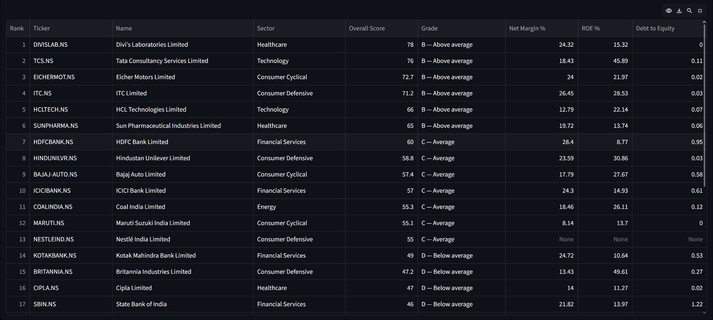
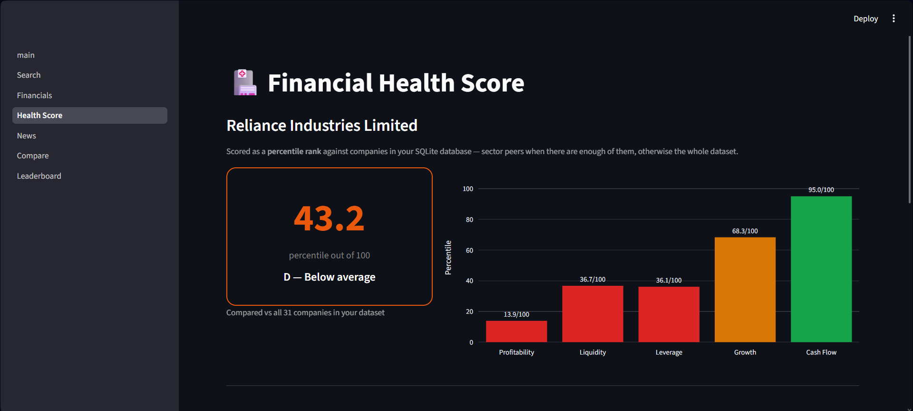
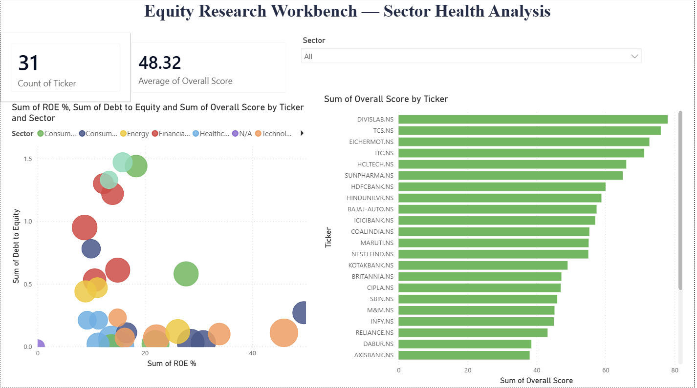

# 📊 Equity Research Workbench V2

A full-stack data pipeline and multi-page dashboard for analyzing NSE/BSE-listed
Indian stocks — live fundamentals from Yahoo Finance, 12 financial ratios computed
from raw statements, a percentile-based health score, cross-company comparison,
Excel report export, and a Power BI dashboard — all backed by a SQLite database
that grows every time a company is researched.

> 🔁 This is V2 — a ground-up rebuild of
> [equity-research-workbench](https://github.com/Akashsh-23/Equity_Research_Workbench)
> (V1). See the [V1 vs V2](#v1-vs-v2) section below for what changed and why.

> ⚠️ Built for research and learning. Not investment advice.

---

## Why this project exists

Most stock dashboards fetch data and show charts. This one tries to answer a harder
question: **how do you turn 12 different ratios into one score that's actually
defensible?**

An earlier version (V1) used fixed thresholds — e.g. "ROE ≥ 20% = excellent." That's
arbitrary and sector-blind: a capital-heavy oil refiner will never score as well as
an asset-light IT company under the same fixed bar, regardless of how well each is
actually run.

This version uses **percentile scoring** instead: every ratio is ranked relative to
other companies already in the database — sector peers specifically, once there are
at least 5 of them. A score of 73 means *"this company beats 73% of its peers on
this metric"*, not *"this company crossed a line someone picked."* The score
recalculates live every time a page loads, recalibrating automatically as more
companies are added.

---

## Architecture

```
                     yfinance API
                          │
                          ▼
              ┌─────────────────────┐
              │   core/fetcher.py   │  company info, 3 financial
              └─────────────────────┘  statements, price history
                          │
                          ▼
              ┌─────────────────────┐
              │   core/ratios.py    │  12 ratios: profitability,
              └─────────────────────┘  liquidity, leverage,
                          │            efficiency, cash flow, growth
                          ▼
              ┌─────────────────────┐
              │  core/database.py   │ ──────────► data/workbench.db
              └─────────────────────┘  SQLite: every search saves a
                          │            dated snapshot; same ticker/day
                          │            upserts in place
                          ▼
          ┌───────────────────────────────┐
          │  core/percentile_score.py     │  ranks each ratio vs sector
          └───────────────────────────────┘  peers (or whole dataset),
                          │                  weights 5 categories → 0-100
           ┌──────────────┼──────────────┐
           ▼              ▼              ▼
    Streamlit App   Excel export   CSV export
    (6 live pages)   (.xlsx report)  export_for_powerbi.py
                                          │
                                          ▼
                                  Power BI Desktop
                             (leaderboard, scatter,
                              sector slicer, cards)
```

`core/seed_data.py` preloads 30 large-cap NSE companies across 6 sectors
(Banking, IT, FMCG, Auto, Pharma, Energy — 5 each) so percentile scoring has
a real peer group from day one.

---

## Features

| Page | What it does |
|---|---|
| **Search** | Any NSE ticker, live price, 52-week range, 1-year chart, company overview |
| **Financials** | Income statement, balance sheet, cash flow + all 12 derived ratios |
| **Health Score** | Percentile rank vs sector peers, category breakdown chart, methodology, Excel download |
| **Compare** | Side-by-side ratio and score comparison across companies in your history |
| **Leaderboard** | Ranks every researched company by score, filterable by sector |
| **News** | Recent headlines via GNews API |

**Additional outputs**
- Per-company Excel report: 3 sheets — Overview + score, Ratios, Peer Comparison
  (your company highlighted in blue)
- Power BI dashboard from SQLite export: leaderboard bar chart, ROE vs Debt
  scatter colored by sector, sector slicer, summary cards

---

## Tech stack

Python · Streamlit · yfinance · pandas · Plotly · SQLite · openpyxl · Power BI Desktop

---

## Setup

### 1. Clone the repo

```bash
git clone https://github.com/Akashsh-23/Equity-Research-Workbench-V2.git
cd equity-research-workbench-v2
```

### 2. Create and activate a virtual environment

```bash
python -m venv venv

# Windows
venv\Scripts\activate

# macOS/Linux
source venv/bin/activate
```

### 3. Install dependencies

```bash
pip install -r requirements.txt
```

### 4. Add your GNews API key (for the News page)

The News page fetches recent headlines via GNews. A free API key gives you
100 requests/day — enough for personal research use.

**Get your key:**
1. Go to [gnews.io](https://gnews.io)
2. Click **Get API Key** — sign up with email (free, no card needed)
3. Your key appears on your dashboard immediately, looks like: `a1b2c3d4e5f6...`

**Add it to the app:**

Open `app/pages/4_News.py` in VS Code and find this line near the top:

```python
GNEWS_API_KEY = "your_api_key_here"
```

Replace `your_api_key_here` with your actual key:

```python
GNEWS_API_KEY = "a1b2c3d4e5f6..."
```

Save the file. The News page will now fetch real headlines.

> 💡 If you prefer not to hardcode the key in the file, create a `.env`
> file in the project root and add `GNEWS_API_KEY=your_key_here`. The
> `.env` file is already in `.gitignore` so it will never be committed.

### 5. Preload sector peer data (recommended)

```bash
python core/seed_data.py
```

This fetches 30 companies across 6 sectors and saves them to SQLite — takes
about 2 minutes, runs silently, and only needs to be done once. Without this,
percentile scoring compares against only the companies you've manually searched.

### 6. Run the app

```bash
streamlit run app/main.py
```

The app opens at `http://localhost:8501`. Navigate pages from the sidebar.

---

## Power BI dashboard

### Prerequisites
- Power BI Desktop installed (free from
  [powerbi.microsoft.com](https://powerbi.microsoft.com/downloads))
- Run seed_data.py first (step 5 above)

### Step 1: Generate the CSV export

```bash
python core/export_for_powerbi.py
```

This creates `data/powerbi_export.csv` with one row per company — all ratios,
percentile scores, sector, and grade.

### Step 2: Open the pre-built dashboard

Open `equity_dashboard.pbix` in Power BI Desktop. It will prompt you to
locate the data source — click **Fix this** or **Edit Settings** and point
it to `data/powerbi_export.csv` in this repo. Click **Close & Apply**.

### Step 3: Refresh as you add more companies

Every time you research new tickers in the Streamlit app, re-run:

```bash
python core/export_for_powerbi.py
```

Then in Power BI Desktop click **Home → Refresh** to pull in the new data.

### What the dashboard shows

| Visual | What it tells you |
|---|---|
| Leaderboard bar chart | All companies ranked by overall health score, sorted |
| ROE vs Debt scatter | Risk/return tradeoff — bubble size = overall score, color = sector |
| Sector slicer | Filters all visuals to one sector simultaneously |
| Summary cards | Companies tracked, average score, top performer |

---

## Project structure

```
equity-research-workbench/
│
├── app/
│   ├── main.py                 # Streamlit entry point, initializes DB
│   └── pages/
│       ├── 1_Search.py         # Ticker search, price chart
│       ├── 2_Financials.py     # Statements + ratios, saves snapshot to DB
│       ├── 3_Health_Score.py   # Percentile score, Excel download
│       ├── 4_News.py           # GNews headlines
│       ├── 5_Compare.py        # Multi-company comparison
│       └── 6_Leaderboard.py    # Ranked leaderboard with sector filter
│
├── core/
│   ├── fetcher.py              # yfinance wrapper
│   ├── ratios.py               # Raw ratio calculations
│   ├── percentile_score.py     # Scoring engine — percentile ranking
│   ├── database.py             # SQLite persistence (snapshots table)
│   ├── seed_data.py            # Preloads 30 companies across 6 sectors
│   ├── excel_report.py         # Generates per-company .xlsx reports
│   ├── export_for_powerbi.py   # Exports SQLite → CSV for Power BI
│   └── news.py                 # GNews API wrapper
│
├── data/                       # Created at runtime — gitignored
│   ├── workbench.db            # SQLite database
│   └── powerbi_export.csv      # CSV snapshot for Power BI
│
├── docs/
│   └── screenshots/            # Add screenshots here for README
│
├── equity_dashboard.pbix       # Power BI dashboard file
├── requirements.txt
├── README.md
└── .gitignore
```

---

## Scoring methodology

Each of the 12 ratios is converted to a percentile rank (0–100) against a
comparison group, then category scores are weighted into one overall score:

| Category | Weight | Ratios used |
|---|---|---|
| Profitability | 30% | Net Margin, ROE, ROCE |
| Liquidity | 20% | Current Ratio, Quick Ratio |
| Leverage | 20% | Debt to Equity, Interest Coverage |
| Growth | 15% | Revenue Growth YoY |
| Cash Flow | 15% | Free Cash Flow |

**Comparison group logic:**
- If the company's sector has **5+ peers** in the database → compare against sector peers only
- If fewer than 5 sector peers exist → fall back to the whole dataset

This means scores are relative, not absolute — a score of 73 means "beats
73% of the comparison group on this metric." The score recalibrates
automatically as more companies are added to the database.

**Known limitations:**
- Needs a reasonable sample size to be meaningful — sector-level comparison
  only activates at 5+ peers; that's why `seed_data.py` exists
- Data freshness is tied to Yahoo Finance's quarterly/annual filing schedule —
  the app always fetches live (no caching), but statements don't update more
  often than companies report
- News relies on GNews free tier (100 req/day)
- Power BI reads a CSV snapshot — re-run export script to refresh it

---

## Screenshots

### Leaderboard


### Health Score


### Power BI Dashboard



---

## V1 vs V2

V1 repo: [equity-research-workbench](https://github.com/Akashsh-23/Equity_Research_Workbench)

This project is a ground-up rebuild. Key differences:

| | V1 | V2 (this repo) |
|---|---|---|
| Scoring | Fixed thresholds, hand-picked | Percentile rank vs. peer group |
| Sector awareness | None — same bar for every sector | Compares within sector when possible |
| Persistence | Session state only (lost on refresh) | SQLite — full search history |
| Cross-company analysis | Not possible | Compare page + Leaderboard |
| External reports | None | Excel export + Power BI dashboard |
| Data pre-loading | Manual only | `seed_data.py` loads 30 companies |
